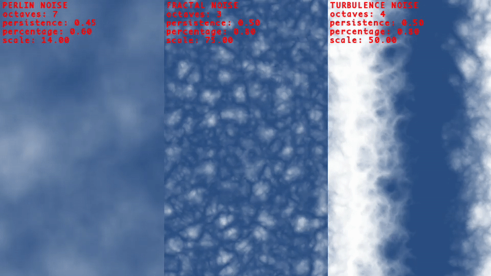

### C++ Header Only Perlin Noise Generator

This project ports the Perlin Noise related code from Christian Petry's
"Texture Generator Online"'s Javascript implementation. Which of itself was a
port of Stefan Gustavson's Java implementation.



Please note that "main.cpp" is an example program and uses SFML and FFMPEG,
however the noise class doesn't have a dependency on any library.

```
#include "noise.hpp"

int main() {
    ...
    SimplexNoise noise;

    for (auto y = 0; y < height; y++) {
      for (auto x = 0; x < width; x++) {
        double v = noise.simplexNoise(SimplexNoise::NoiseTypeEnum::PERLINNOISE,
                                      width,
                                      7,     // octaves
                                      0.45,  // persistence
                                      0.6,   // percentage
                                      14,    // scale
                                      x,
                                      y,
                                      z);    // time

        pixels[index++] = v * 255  // R
        pixels[index++] = v * 255  // G
        pixels[index++] = v * 255  // B
        pixels[index++] =     255; // A
      }
    }
    ...
}
```

In case of the example image, blending two colors rgb(255, 255, 255) and sky
blue rgb(42, 77, 130).

```
pixels[index++] = v * 255 + ((1.0 - v) * 42);   // R
pixels[index++] = v * 255 + ((1.0 - v) * 77);   // G
pixels[index++] = v * 255 + ((1.0 - v) * 130);  // B
pixels[index++] =     255;                      // A
```

### BACKGROUND INFO

My guess is that Christian added the fractal and turbulence modes on top of the
original Java version. I just made slight modifications to the code and
currently use the z-axis for time, in order to animate the noise.

His Javascript code can be found here:
https://github.com/cpetry/TextureGenerator-Online

See it in action:
https://cpetry.github.io/TextureGenerator-Online/

Stefan Gustavson's Java code here:
http://staffwww.itn.liu.se/~stegu/simplexnoise/simplexnoise.pdf¬


### LICENSE

Copyright 2020 Ray Burgemeestre

Permission is hereby granted, free of charge, to any person obtaining a copy of
this software and associated documentation files (the "Software"), to deal in
the Software without restriction, including without limitation the rights to
use, copy, modify, merge, publish, distribute, sublicense, and/or sell copies
of the Software, and to permit persons to whom the Software is furnished to do
so, subject to the following conditions:

The above copyright notice and this permission notice shall be included in all
copies or substantial portions of the Software.

THE SOFTWARE IS PROVIDED "AS IS", WITHOUT WARRANTY OF ANY KIND, EXPRESS OR
IMPLIED, INCLUDING BUT NOT LIMITED TO THE WARRANTIES OF MERCHANTABILITY,
FITNESS FOR A PARTICULAR PURPOSE AND NONINFRINGEMENT. IN NO EVENT SHALL THE
AUTHORS OR COPYRIGHT HOLDERS BE LIABLE FOR ANY CLAIM, DAMAGES OR OTHER
LIABILITY, WHETHER IN AN ACTION OF CONTRACT, TORT OR OTHERWISE, ARISING FROM,
OUT OF OR IN CONNECTION WITH THE SOFTWARE OR THE USE OR OTHER DEALINGS IN THE
SOFTWARE.


### KNOWN ISSUES

- The original Java implementation has a 3D noise version, which is not ported.
- There are multiple ways to animate the perlin noise, there may be different
  and alternative ways to animate the noise that are worth investigating.
- No effort has been made to optimize the code further for C++ for now.
